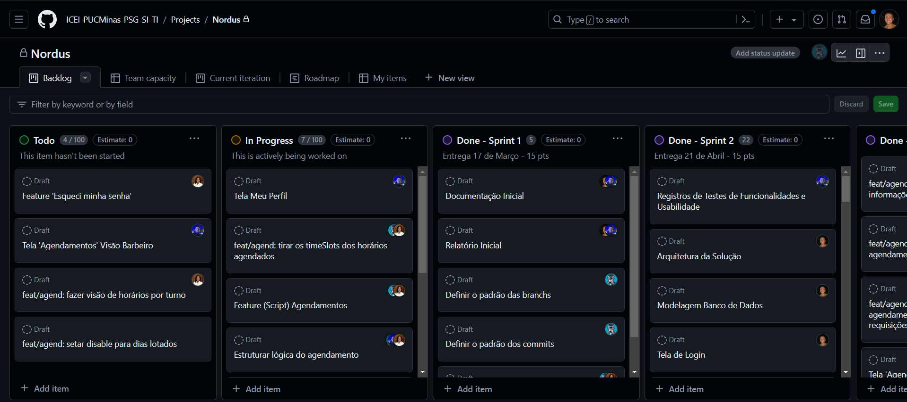

# Especificações do Projeto

O aplicativo que será desenvolvido para a Barbearia Nordus visa resolver diversos desafios enfrentados pelo estabelecimento. A ideia principal é criar um sistema de agendamento intuitivo e eficiente, permitindo que os clientes marquem horários de forma simples, visualizem disponibilidade em tempo real e recebam lembretes para suas marcações.

Além disso, pretende-se aprimorar a gestão das diferentes assinaturas oferecidas, como Assinante de Corte, Assinante de Barba e Assinante de Corte e Barba, com a criação de um módulo específico no aplicativo para que os clientes possam visualizar detalhes de suas assinaturas atuais.

Para aumentar a visibilidade dos patrocinadores da barbearia, será implementada uma seção dedicada no aplicativo, exibindo logos e informações relevantes dos parceiros, proporcionando assim visibilidade para ambos.

A barbearia também planeja expandir sua presença online com a introdução de uma área de catálogo no aplicativo. Isso permitirá que os clientes naveguem pelos produtos, verifiquem a disponibilidade em tempo real e leiam descrições detalhadas antes de efetuarem a reserva do produto.

Por fim, o aplicativo será desenvolvido com uma interface customizada, utilizando as cores, logotipos e estilo visual característicos da barbearia para criar uma conexão mais forte e pessoal com os clientes.

## Personas

1° SANTOS HENRIQUE - 37 Anos  
Dono de estabelecimento de barbearia. Pensa em buscar uma forma de agilizar a gestão da sua barbearia e enriquecer sua presença online.
Ele procura algum aplicativo onde possa deixar com a cara de seu estabelecimento

2° FELIPE SILVA - 30 Anos  
É um profissional de marketing que preza pela praticidade em sua rotina agitada, busca conveniência ao agendar seus cortes de cabelo e barbas, desejando um aplicativo intuitivo que permita marcar horários facilmente e receber lembretes automáticos. Além disso, ele está interessado em produtos de cuidados pessoais oferecidos pela barbearia e gostaria de explorar o catálogo para verificar oque a barbearia tem a oferecer.

3° MARCOS ANTÔNIO - 23 Anos  
É um empreendedor no ramo da moda e beleza, busca um aplicativo que ofereça praticidade ao agendar seus cortes e tratamentos, permitindo escolher entre diferentes profissionais e visualizar disponibilidade em tempo real. Além disso, como influenciador digital, ele está interessado em colaborações com a barbearia, buscando uma seção dedicada aos patrocinadores no aplicativo.

4° RODRIGO PEREIRA - 26 Anos  
É um talentoso barbeiro, com vasta experiência na área, ele é conhecido por sua habilidade em criar cortes modernos e estilosos. Como barbeiro dedicado, Rodrigo enfrenta desafios diários ao gerenciar seus horários de atendimento. Ele busca um sistema de agendamento que ofereça praticidade, permitindo-lhe visualizar facilmente sua agenda e planejar seu dia de trabalho de forma eficiente. 

## Histórias de Usuários

Com base na análise das personas forma identificadas as seguintes histórias de usuários:

|EU COMO... `PERSONA`| QUERO/PRECISO ... `FUNCIONALIDADE` |PARA ... `MOTIVO/VALOR`                 |
|--------------------|------------------------------------|----------------------------------------|
|Dono da Barbearia   | QUERO/PRECISO de um sistema de agendamento intuitivo e eficiente         | PARA agilizar o processo de marcação de horários dos clientes, evitando conflitos e facilitando a gestão do estabelecimento.               |
|Cliente da Barbearia      | QUERO/PRECISO de um aplicativo para agendar cortes e barbas                 | PARA ter a conveniência de marcar horários facilmente, receber lembretes automáticos e desfrutar da qualidade dos serviços da barbearia. |
|Cliente da Barbearia| QUERO/PRECISO de uma seção na catálogo do aplicativo | PARA descobrir produtos exclusivos da barbearia, complementando meus cuidados de beleza e apoiando o estabelecimento. |
|Dono da Barbearia| QUERO/PRECISO de um módulo de gestão de assinaturas |PARA facilitar o acompanhamento dos planos de Assinante de Corte, Assinante de Barba e Assinante de Corte e Barba oferecidos pela barbearia.
|Funcionário da Barbearia |QUERO/PRECISO de acesso ao sistema de agendamento | PARA verificar meus horários de atendimento, visualizar as marcações dos clientes e organizar meu dia de trabalho de forma eficiente.|

## Requisitos

As tabelas que se seguem apresentam os requisitos funcionais e não funcionais que detalham o escopo do projeto. Para determinar a prioridade de requisitos, aplicar uma técnica de priorização de requisitos e detalhar como a técnica foi aplicada.

### Requisitos Funcionais

|ID    | Descrição do Requisito  | Prioridade |
|------|-----------------------------------------|----|
|RF-001| Sistema de Agendamento Intuitivo e Eficiente| ALTA | 
|RF-002| Módulo de Gestão de Assinaturas para os Clientes  | ALTA |
|RF-003| Seção para Destacar Patrocinadores no Aplicativo | MÉDIA|
|RF-004| Implementar um catálogo para Exibição de Produtos|ALTA|
|RF-005| Interface Personalizada que Reflita a Identidade da Barbearia|MÈDIA|
|RF-006| Sistema de favoritar serviços para facilitar o agendamento|BAIXA|

### Requisitos não Funcionais

|ID     | Descrição do Requisito  |Prioridade |
|-------|-------------------------|----|
|RNF-001|	Segurança dos Dados: Garantir a proteção e privacidade das informações dos clientes e da barbearia	|ALTA|
|RNF-002| Usabilidade Intuitiva: Interface amigável e de fácil utilização para clientes e funcionários	|ALTA|
|RNF-003|	Desempenho Eficiente: Respostas rápidas do sistema mesmo em horários de pico	|ALTA|
|RNF-004|	Confiabilidade do Sistema: Garantir que o sistema esteja disponível 24/7 sem falhas frequentes	|ALTA|
|RNF-005|	Manutenibilidade: Facilidade de realizar atualizações e manutenções no sistema	|MÉDIA|
|RNF-006|	Backup e Recuperação: Implementar rotinas de backup regular e eficaz dos dados do aplicativo	|BAIXA|
|RNF-007|	Escalabilidade: Capacidade de lidar com um aumento significativo de usuários sem perda de desempenho|	BAIXA|

## Restrições

O projeto está restrito pelos itens apresentados na tabela a seguir.

|ID| Restrição                                             |
|--|-------------------------------------------------------|
|01| O projeto deverá ser entregue até o final do semestre |
|02| O sistema deve ser desenvolvido utilizando a linguagem de programação especificada pela equipe técnica.|
|03| O sistema deve estar em conformidade com a LGPD|
|04| A interface do aplicativo deve ser compatível com os principais sistemas operacionais móveis.|

## Diagrama de Casos de Uso
<strong>Caso de uso para agendamento de horário</strong>  

<strong>Caso de uso para reservar produtos</strong>  

<strong> Caso de uso para assinar o plano Nordus</strong> 

# Gerenciamento de Projeto

## Gestão de Orçamento

