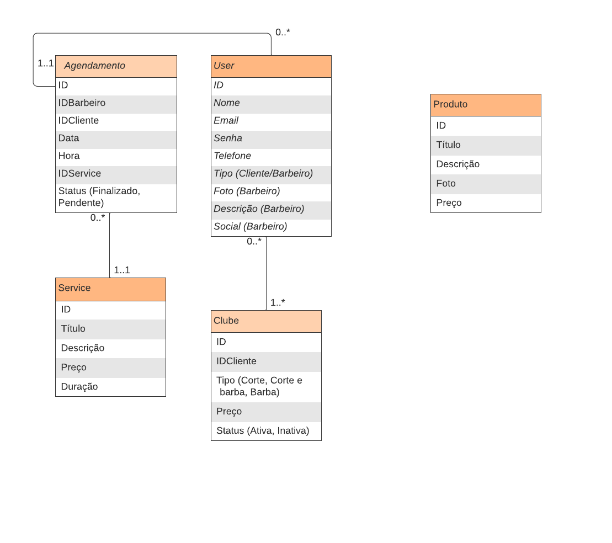

# Arquitetura da Solução
<!-- 
Pré-requisitos: <a href="3-Projeto de Interface.md"> Projeto de Interface</a>

Definição de como o software é estruturado em termos dos componentes que fazem parte da solução e do ambiente de hospedagem da aplicação.

## Diagrama de Classes

O diagrama de classes ilustra graficamente como será a estrutura do software, e como cada uma das classes da sua estrutura estarão interligadas. Essas classes servem de modelo para materializar os objetos que executarão na memória.

As referências abaixo irão auxiliá-lo na geração do artefato “Diagrama de Classes”.

> - [Diagramas de Classes - Documentação da IBM](https://www.ibm.com/docs/pt-br/rational-soft-arch/9.6.1?topic=diagrams-class)
> - [O que é um diagrama de classe UML? | Lucidchart](https://www.lucidchart.com/pages/pt/o-que-e-diagrama-de-classe-uml)
-->
## Modelo ER e Esquema Relacional

#### 1. Usuário
- Representa os usuários do sistema, incluindo clientes e barbeiros.
- Relacionamentos:
  - Um usuário pode fazer vários agendamentos.
  - Um usuário pode estar associado a nenhum, ou mais clube de assinatura (mesmo inativos).

#### 2. Serviço
- Refere-se aos serviços oferecidos pela barbearia, como cortes de cabelo, barba, etc.
- Relacionamentos:
  - Vários agendamentos podem estar associados a um serviço.

#### 3. Clube
- Representa os clubes de assinatura oferecidos pela Barbearia Nordus.
- Relacionamentos:
  - Um clube pode ter um usuário associado a ele.

#### 4. Agendamento (*Appointment*)
- Refere-se aos agendamentos feitos pelos clientes para os serviços da barbearia.
- Atributos: data, horário, status, informações adicionais.
- Relacionamentos:
  - Um agendamento é feito por um único usuário.
  - Um agendamento está associado a um único serviço.
  - Um agendamento está vinculado a um único clube de assinatura (se aplicável).

## Restrições de Projeto

### Restrições do Projeto:

1. **Tempo:** O projeto está sujeito a restrições de tempo, com um prazo definido para o desenvolvimento e implementação da aplicação.

2. **Recursos:** Os recursos disponíveis, incluindo equipe e tecnologias são limitados.

<!--
O Modelo ER representa através de um diagrama como as entidades (coisas, objetos) se relacionam entre si na aplicação interativa.]

As referências abaixo irão auxiliá-lo na geração do artefato “Modelo ER”.

> - [Como fazer um diagrama entidade relacionamento | Lucidchart](https://www.lucidchart.com/pages/pt/como-fazer-um-diagrama-entidade-relacionamento)
 
## Esquema Relacional

O Esquema Relacional corresponde à representação dos dados em tabelas juntamente com as restrições de integridade e chave primária.
 
As referências abaixo irão auxiliá-lo na geração do artefato “Esquema Relacional”.

> - [Criando um modelo relacional - Documentação da IBM](https://www.ibm.com/docs/pt-br/cognos-analytics/10.2.2?topic=designer-creating-relational-model)

## Modelo Físico

Entregar um arquivo banco.sql contendo os scripts de criação das tabelas do banco de dados. Este arquivo deverá ser incluído dentro da pasta src\bd.

## Tecnologias Utilizadas

Descreva aqui qual(is) tecnologias você vai usar para resolver o seu problema, ou seja, implementar a sua solução. Liste todas as tecnologias envolvidas, linguagens a serem utilizadas, serviços web, frameworks, bibliotecas, IDEs de desenvolvimento, e ferramentas.

Apresente também uma figura explicando como as tecnologias estão relacionadas ou como uma interação do usuário com o sistema vai ser conduzida, por onde ela passa até retornar uma resposta ao usuário.

## Hospedagem

Explique como a hospedagem e o lançamento da plataforma foi feita.

> **Links Úteis**:
>
> - [Website com GitHub Pages](https://pages.github.com/)
> - [Programação colaborativa com Repl.it](https://repl.it/)
> - [Getting Started with Heroku](https://devcenter.heroku.com/start)
> - [Publicando Seu Site No Heroku](http://pythonclub.com.br/publicando-seu-hello-world-no-heroku.html)
-->
## Qualidade de Software

### Padronização de Qualidade de Produto

Para nortear o desenvolvimento do projeto de software da Barbearia Nordus, nossa equipe selecionou as seguintes subcaracterísticas, da norma internacional ISO/IEC 25010 como base para garantir a qualidade do proudto:

1. **Usabilidade:** Considerando o nível de importância de uma interface intuitiva a Barbearia, a subcaracterística "Facilidade de Aprendizado" será prioritária. Métricas como tempo médio para realização de tarefas e taxa de erros de usuário serão utilizadas para avaliar essa subcaracterística.

2. **Confiabilidade:** Dada a necessidade de uma aplicação robusta e confiável, a subcaracterística "Tolerância a Falhas" será enfatizada. Métricas como tempo médio entre falhas e taxa de falhas corrigidas serão acompanhadas para garantir a estabilidade do sistema.

3. **Eficiência:** Devido o uso intensivo de recursos móveis, a subcaracterística "Desempenho" será monitorada de perto. Métricas como tempo de resposta do aplicativo e utilização de CPU serão medidas para garantir uma experiência eficiente para os usuários.

<!--
> **Links Úteis**:
>
> - [ISO/IEC 25010:2011 - Systems and software engineering — Systems and software Quality Requirements and Evaluation (SQuaRE) — System and software quality models](https://www.iso.org/standard/35733.html/)
> - [Análise sobre a ISO 9126 – NBR 13596](https://www.tiespecialistas.com.br/analise-sobre-iso-9126-nbr-13596/)
> - [Qualidade de Software - Engenharia de Software 29](https://www.devmedia.com.br/qualidade-de-software-engenharia-de-software-29/18209/)
-->
